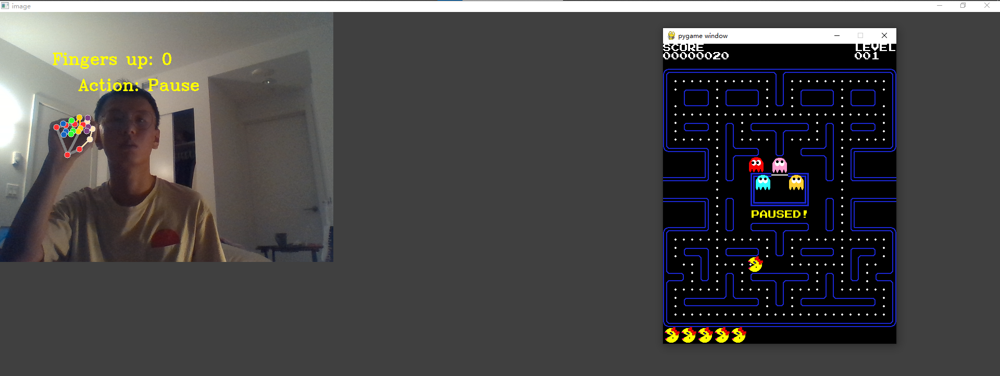

# CS5330-handgesture-project
## Instructions for play the game

It should be noted that this game works for Windows platform, for Macintosh, we have trouble getting the permission from system settings. We are happy to learn from anyone who has a solution to this problem.

<ul>
  <li>Clone this repository to your local.</li>
  <li>Run 'cd CS5330-handgesture-project'.</li>
  <li>Make sure you have python (at least 3.7+) installed on your device. Run 'python -m venv mp_env'.</li>
  <li>On Windows, run './mp_env/Scripts/Activate.ps1'. On Macintosh, run 'source mp_env/bin/activate'.</li>
  <li>Once you have the virtual environment set up, run 'pip install opencv && pip install mediapipe && pip install pygame'.</li>
  <li>Open Another terminal window. Cd to the cloned repository, set up the virtual environment again and run 'cd ./game/Pacman_Complete'</li>
  <li>Make sure you have No.1 terminal window on the 'CS5330-handgesture-project' directory, and have your No.2 terminal window on the 'CS5330-handgesture-project/game/Pacman_Complete' directory. Then, on the No.1 terminal window, run 'python module_test.py', and on your No.2 terminal window, run 'python run.py'. Now you should have your hand detection program and your game open.</li>
  <li>Adjust your two windows to a comfortable position, make sure the focus is on the game window and enjoy!</li>
</ul>

## The game is accredited from open source project:
https://www.pygame.org/project-Pacman-426-.html

<!-- ## Tested with chromedino.com
 -->
